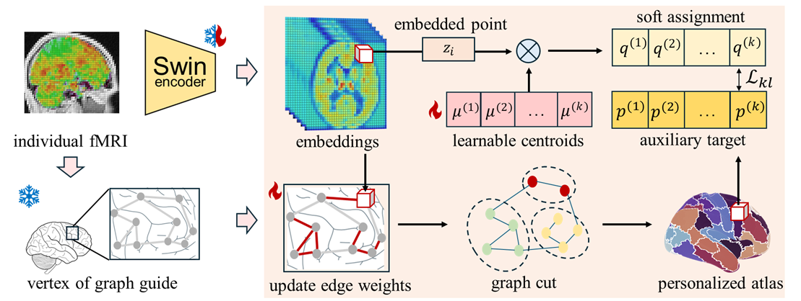

# DCA: Graph-Guided Deep Embedding Clustering for Brain Atlases

This repository contains the official implementation of our **NeurIPS 2025** paper [**DCA: Graph-Guided Deep Embedding Clustering for Brain Atlases**](https://arxiv.org/abs/2509.01426). The method integrates pretraining and spatial graph-based constraints to generate anatomically and functionally meaningful brain atlases.




## DCA Usage

0. Dependencies

We recommend using `Python == 3.9.21`.

All required packages are listed in `DCA/req_trim.txt`. 


1. Prepare Data
   

Use `DCA/data/data_preparation.ipynb` to prepare both fMRI and mask data: fMRI inputs should be resting-state scans normalized to the MNI152 space with at least 300 TRs (note that if TR ≠ 0.72 s, it is recommended to resample temporally to 0.72 s beforehand, as this step is not included in the notebook), and mask inputs should be the corresponding FreeSurfer `aparc+aseg.nii.gz` already registered in MNI152 space.

Place preprocessed 4D fMRI volumes in `DCA/data/fmri/`, we have placed a demo fMRI.

Place your ROI masks in `DCA/data/mask/`. This implementation supports customization for gray matter, white matter, and subcortex-specific atlases. We have placed a demo mask.

Ensure data/sub_test.txt contains the list of subject IDs (one per line), we have placed a demo text.

The pretrained model (swin_model_epoch_30.pth) is automatically loaded if present. We conduct pre-training using monai (https://monai.io/) and customize some functions through DCA/swin_unetr.py


2. Run DCA

```bash
python main.py
```

This will generate subject-level brain parcellations using the provided pretrained model. Results will be saved to results/demo/.

 Command-line Options

You can customize key inference settings via arguments in `main.py`. The main options are:

- `-k`, `--n_clusters`: Number of parcels to generate (default: `100`)
- `-e`, `--epoch`: Maximum training epochs (default: `8`)
- `-v`, `--vali`: Whether to keep the best atlas based homogeneity (default: `True`)

 Validation requires more computing resources. If `--vali` is set to `False`, we recommend using `--epoch < 10` to avoid overfitting.


3. Results

Output can be found in data/results/demo

## AtlaScore Usage
### Downstream
For all the operation instructions, please see `demo.ipynb`.

### Similarity
- Provide fMRI data `shape=(x,y,z,t)` and the atlas file `shape=(x,y,z)` to be evaluated, modify the paths in `eva.py`, and run the command `python eva.py`.
- To evaluate DCBC, you must provide the following files mapped to cortical surface vertices: fMRI data, vertex distance file, and parcellation file. Refer to [Zhi et al.](https://github.com/DiedrichsenLab/DCBC) for more detailed methodological instructions.

## Citations
If you find our work useful for your research, please consider citing our paper:
```bibtex
@article{wang2025dca,
  title={DCA: Graph-Guided Deep Embedding Clustering for Brain Atlases},
  author={Wang, Mo and Peng, Kaining and Tang, Jingsheng and Wen, Hongkai and Liu, Quanying},
  journal={arXiv preprint arXiv:2509.01426},
  year={2025}
}
```
